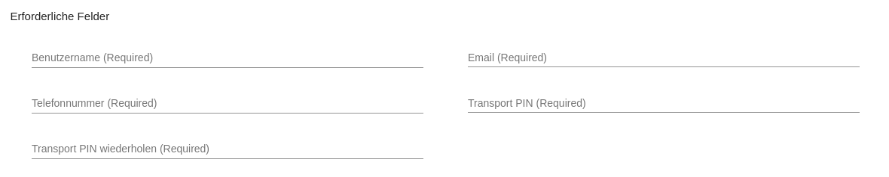
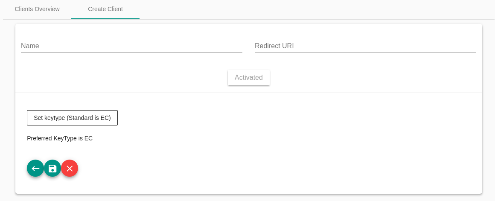
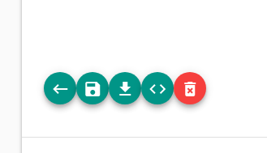
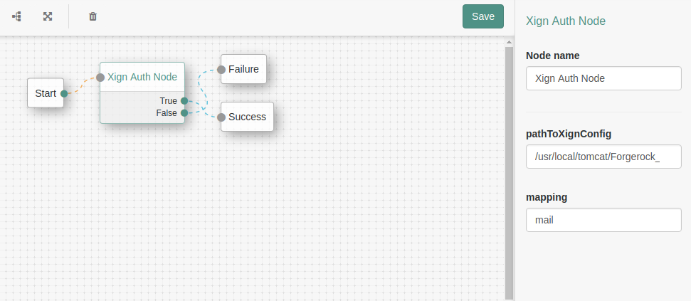
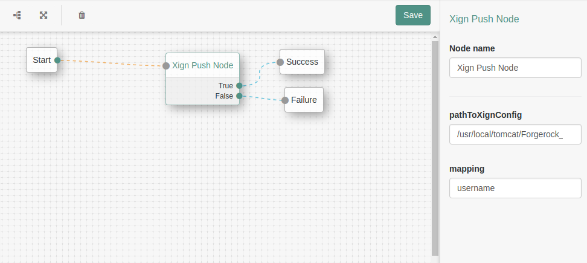
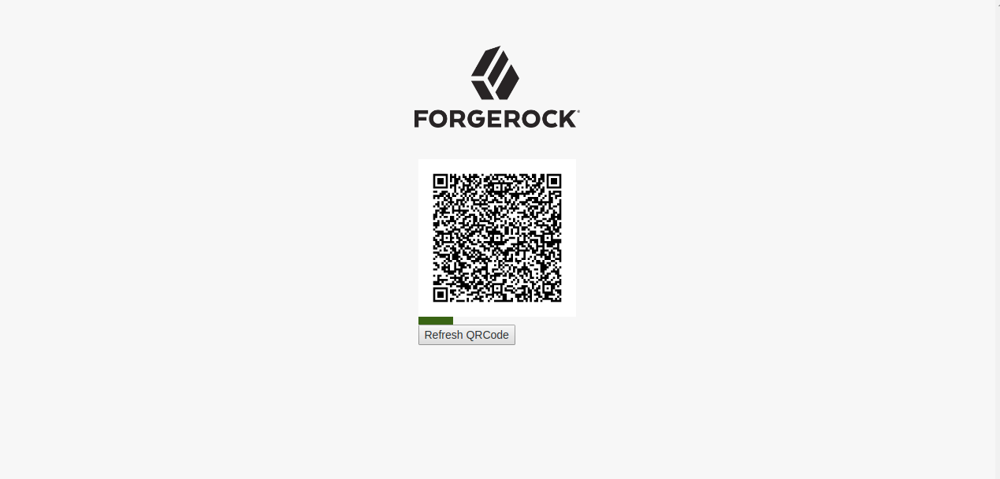
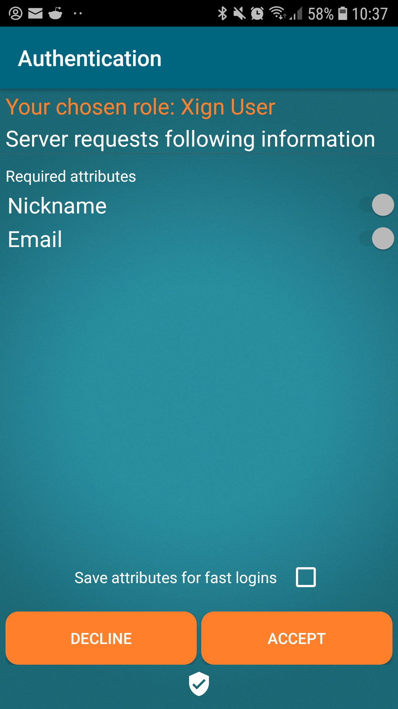
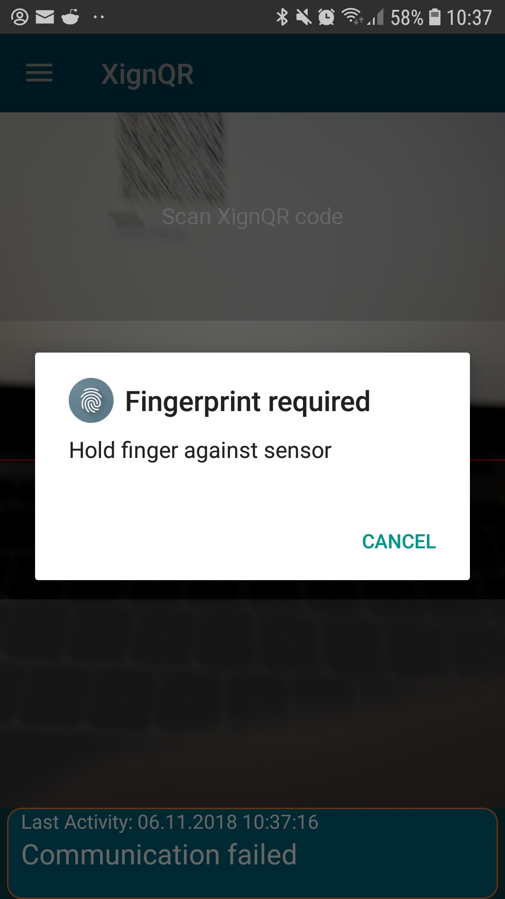
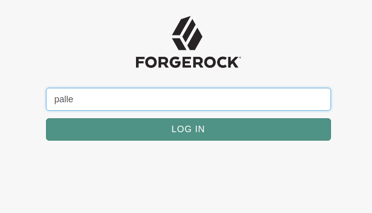

<!--
 * The contents of this file are subject to the terms of the Common Development and
 * Distribution License (the License). You may not use this file except in compliance with the
 * License.
 *
 * You can obtain a copy of the License at legal/CDDLv1.0.txt. See the License for the
 * specific language governing permission and limitations under the License.
 *
 * When distributing Covered Software, include this CDDL Header Notice in each file and include
 * the License file at legal/CDDLv1.0.txt. If applicable, add the following below the CDDL
 * Header, with the fields enclosed by brackets [] replaced by your own identifying
 * information: "Portions copyright [year] [name of copyright owner]".
 *
 * Copyright ${data.get('yyyy')} ForgeRock AS.
-->
# XignQR-Authnode

An authentication node for integration with the [XignQR Authentication System](https://xignsys.com). Using XignQR you will be able to authenticate against OpenAM > v6.5 using your smartphone.

# Installation
Copy the .jar file from the ../target directory into the ../web-container/webapps/openam/WEB-INF/lib directory where AM is deployed.  Restart the web container to pick up the new node.  The node will then appear in the authentication trees components palette.

**USAGE HERE**

To use authentication via smartphone you have to download the XignQR App and register yourself at [XignQR Public](https://public.xignsys.com) to be able to configure your client (aka ForgeRock OpenAM).

Fill in the provided form

A QR Code is sent to you via email. The qr code is used to enroll your smartphone in the XignQR System. As soon as you have received the qr code follow these instructions:

1. Open up the app, type in the transport pin you have provided when registering yourself. 

2. The App then prompts for some authentication factors

3. Press personalize to enroll your device

4. The personalization process takes about 30 seconds until you are enrolled

**Configuration**

Log in to  [XignQR Public](https://public.xignsys.com/m) and register your client.

After Registration, select your newly created client and use the controls to download the properties file

Place the downloaded Properties on the filesystem of your OpenAM Installtion and provide the path in the configuration of the auth node. And map the attributes that should be matched.

**Example XignQR**

**Example XignPush**

# Authentication
**XignQR**
Open up your personalized XignQR App and scan the displayed qr code with the integrated qr code scanner.

After scanning the qr code, the app gives a haptic feedback, and you'll see that the app communicates with the XignQR backend system.
You'll be prompted to accept or decline the delivery of the displayed attributes to openam.

After you have accepted the delivery of the attributes, you'll be prompted to authenticate yourself against the XignQR App. 
If you have configured a fingerprint when you personalized your device, you'll be prompted for fingerprint authentication,
if not you'll be prompted to enter your personal PIN.

**XignPush**
When using XignPush you'll have to enter your XignQR username to be able to log in. 

The XignQR system will deliver a push notification to your device. When you press on the notification, the XignQR app will open up.
And the flow will be similar to that of using XignQR.

[forgerock_platform]: https://www.forgerock.com/platform/  

