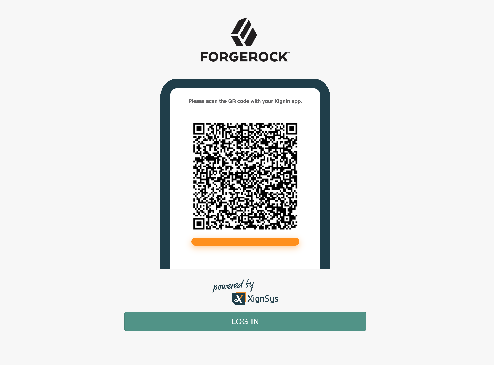

<!--
 * The contents of this file are subject to the terms of the Common Development and
 * Distribution License (the License). You may not use this file except in compliance with the
 * License.
 *
 * You can obtain a copy of the License at legal/CDDLv1.0.txt. See the License for the
 * specific language governing permission and limitations under the License.
 *
 * When distributing Covered Software, include this CDDL Header Notice in each file and include
 * the License file at legal/CDDLv1.0.txt. If applicable, add the following below the CDDL
 * Header, with the fields enclosed by brackets [] replaced by your own identifying
 * information: "Portions copyright [year] [name of copyright owner]".
 *
 * Copyright ${data.get('yyyy')} ForgeRock AS.
-->

# XignIn-Authnode

An authentication node for integration with the [XignIn Authentication System](https://xignsys.com). Using XignIn you
will be able to authenticate against OpenAM > v6.5 using your smartphone.

# XignIn Authentication

XignIn offers you the ability to login and get access to ICT Systems, e. g. ForgeRock, password-less via Smartphone,
backed by a high security SaaS platform. Use XignIn as 1-, 2- and M-Factor Authentication tool. Easily integrated via QR
Code or Push-Authentication to mitigate cyberattacks like Phishing.

# Installation

Copy the .jar file from the ../target directory into the ../web-container/webapps/openam/WEB-INF/lib directory where AM
is deployed. Restart the web container to pick up the new node. The node will then appear in the authentication trees
components palette.

**USAGE HERE**

To use authentication via smartphone you have to download the XignIn App and register yourself
at [XignIn Public](https://xign.me/registration) to be able to configure your client (aka ForgeRock OpenAM).

Fill in the provided form. Only your e-mail address and the activation PIN are required fields.

A QR Code is sent to you via email. The qr code is used to enroll your smartphone in the XignIn System. As soon as you
have received the qr code follow these instructions:

1. Open up the app, type in the transport pin you have provided when registering yourself.

2. The App then prompts for some authentication factors

3. Press personalize to enroll your device

4. The personalization process takes about 30 seconds until you are enrolled

**Configuration**

Log in to  [XignIn Public](https://xign.me/login) to create an organization and register your client (i.e. your
forgerock instance).

1. Create your organization. From the menu to your left choose _Add Organization_

2. Fill in the name of your Organization (Name is the only required field) and click the accept button in the lower right
   corner

3. After your organization is created, you will be taken to the overview. Click the _EDIT_ link of your newly created
   organization.

4. You will see the overview of your empty organization.

5. Now you will have to add service to your organization to establish the trust relationship between you openam instance
   and XignIn. To do so click the _ADD_ link. A Window will open, where you have to provide the necessary information:

- _Name_ - The name of your client
- _Encryption Algorithm (EC or RSA, EC recommended)_ - the algorithm used to encrypt the XignIn authentication response
- _Redirect URL_ - a vanity URL
- _Login Domain_ - the domain name from which the authentication is triggered. E.g. if your OpenAM instance is deployed
  on https://example.com/openam, using https://example.com as the Login Domain is sufficient

6. After successful registration of your client the newly created client will appear under in the services menu

7. Last but not least, you have to activate your client and download the corresponding configuration file. To do so,
   click the pen icon next to your created client to pen the client configuration view. Choose the pen icon of your
   client card and toggle the _active_ slider to activate your client. By clicking the download icon you can download
   the configuration files.

**Example XignIn Configuration**

This is the straight forward configuration for the use of _XignIn for MFA_:
The zip-archive you downloaded contains a json file, whose contents have to be copied to the jsonConfig field of the node configuration.

To map the XignIn Identity to your corresponding OpenAM Identity you can configure following mappings: 
1. For _From XignIn Mapping_ choose _EMAIL_
2. For _To Forgerock Mapping_ choose _MAIL_ or _USERNAME_
3. Optionally you can enable the creation of a identity in OpenAM if it does not exist by toggling _Create User on First Login_

Via the drop-down mapping menu, you will be able to configure, which data should match the identity attributes in your
identity repository. The data is delivered by the XignIn system.

# Authentication

**XignIn**

Open up your personalized XignIn App and scan the displayed qr code with the integrated qr code scanner.

After scanning the qr code, the app gives a haptic feedback, and you'll see that the app communicates with the XignIn
backend system. You'll be prompted to accept or decline the delivery of the displayed attributes to openam.

After you have accepted the delivery of the attributes, you'll be prompted to authenticate yourself against the XignIn
App. If you have configured a fingerprint when you personalized your device, you'll be prompted for fingerprint
authentication, if not you'll be prompted to enter your personal PIN.

[forgerock_platform]: https://www.forgerock.com/platform/  

